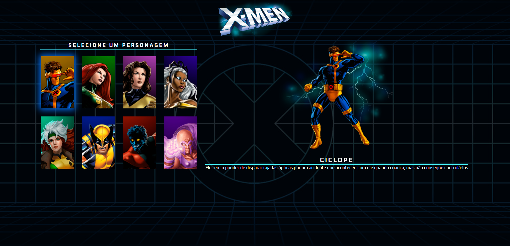
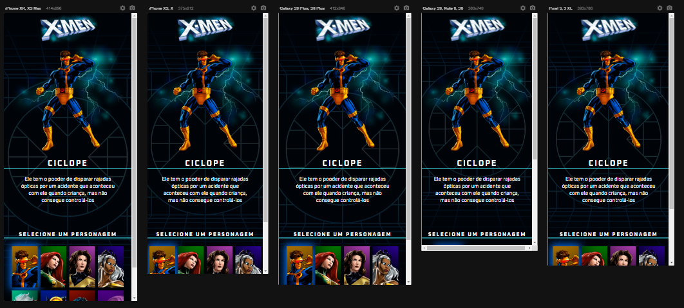

# 

<h1 align="center"> Projeto X-men  </h1>

Projeto em desenvolvimento acompanhando a semana DEV EM DOBRO com a dupla dinâmica de gêmeos Roberto e Ricardo  

  <a href="#-tecnologias">Tecnologias</a>&nbsp;&nbsp;&nbsp;|&nbsp;&nbsp;&nbsp;
  <a href="#-projeto">Projeto</a>&nbsp;&nbsp;&nbsp;|&nbsp;&nbsp;&nbsp;
  <a href="#memo-licença">Licença</a>

  

 

  

    <h4> Background Original Projeto Dev em Dobro
     
     
      
     
    <h4> Background Mobile - Multiple Screen
     
     
      
  

 
  🧑‍🚀 Este projeto foi apresentado pelos irmãos Roberto e Ricardo Dias, do canal <a target="_blank" href="https://www.youtube.com/@DevemDobro">"DEV EM DOBRO".
</a>

 

## 🤓 Tecnologias

Esse projeto foi desenvolvido com as seguintes tecnologias:

<li> HTML
<li> CSS
<li> JavaScript
<li> Git and GitHub
 
